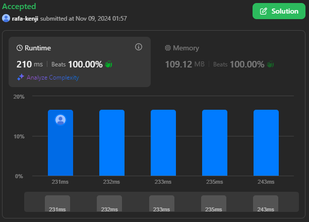

# LeetCode_Questoes

**Número da Lista**: 42 
**Conteúdo da Disciplina**: Grafos1 

## Alunos
|Matrícula | Aluno |
| -- | -- |
| 19/0044128  |  Rafael Kenji Taira |
| 22/2032810  |  Felipe Aguiar Hansen |

## Sobre 

Este projeto consiste em três códigos desenvolvidos para resolver questões específicas de grafos da plataforma LeetCode. O objetivo é oferecer soluções para problemas de média e alta dificuldade em grafos, passando por problemas como encontrar o menor caminho, detectar ciclos e calcular a conectividade de nós. Cada código utiliza a linguagem C para resolver o problema específico, aproveitando estruturas de dados otimizadas para garantir desempenho e clareza.

**Problemas**
|Código | Título | Dificuldade |
| -- | -- | -- |
| [797](https://leetcode.com/problems/all-paths-from-source-to-target/description/)| All Paths From Source to Target | Média |
| [785](https://leetcode.com/problems/is-graph-bipartite/description/) | Is Graph Bipartite? | Média |
| [834](https://leetcode.com/problems/sum-of-distances-in-tree/description/) | Sum of Distances in Tree | Difícil |
| [2608](https://leetcode.com/problems/shortest-cycle-in-a-graph/description/) | Shortest Cycle in a Graph | Difícil |

## Screenshots
- Questão 797

- Questão 785

- Questão 834

- Questão 2608

## Uso 
**Linguagem**: C 
Para verificar as resoluções das questões, copie a resolução da questão desejada que está dentro de sua respectiva pasta e cole na página de exercício do leetcode que tenha a questão ou no código na seção dos problemas apresentados anteriormente

